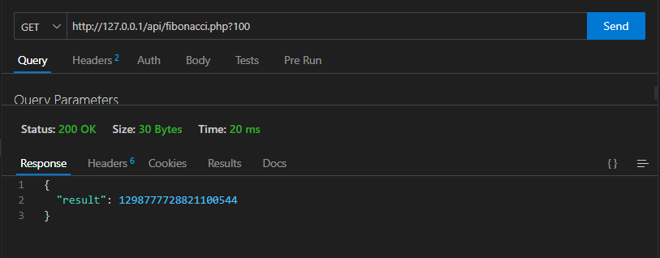

# Solution Fibonacci.

Hello, I'm Gabriel Jesus.

Here is my solution for the test.
To introduce, I did a simple code, so I just create a 'fibonacci.php' where's the solution and create a docker-compose very simple.

I'm justifying me because, I used nothing here (no framework, no architecture...).

# How to run:
- on root of project run: `docker-compose up`
- and for request the url is: http://127.0.0.1/api/fibonacci.php?100

